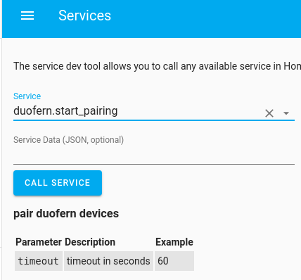
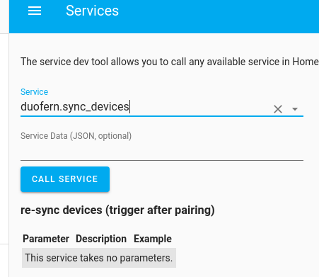
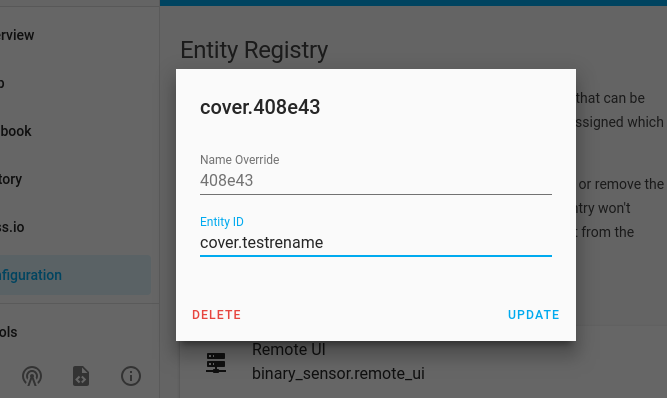

Examples
========

Setup with Hassio
-----------------

The following is setup procedure with hassio

- install hassio
- via the GUI enable the `SSH Server addon <https://www.home-assistant.io/addons/ssh/>`_
- login via ssh
- connect the stick
- download the pyduofern repo via git, copy the custom component and add duofern to your config by running::

     git clone https://github.com/gluap/pyduofern/
     cp -r pyduofern/examples/homeassistant/custom_components /config/
     # next line only if you don't already have it yet:
     echo "duofern:" >> /config/configuration.yaml
     # next use 4 digit hex code of your choice instead of ffff ("password" for your duofern net)
     # if you are migrating from FHEM: Skip the "6f" from the beginning of the code,
     # only use the last 4 characters
     echo "  code: ffff" >> /config/configuration.yaml
     echo -n "  serial_port: " >> /config/configuration.yaml && ls /dev/serial/by-id/usb-Rademacher_DuoFern* >> /config/configuration.yaml

- restart homeassistant via the GUI
- stick should stop blinking once homeassistant initializes it
- devices previously paired with the coded should be auto-detected, if not call the service ``duofern.sync_devices`` (see below).
- to pair a device call the service ``duofern.start_pairing`` via the gui and do the pairing motions from the manual of the device

- to force a refresh of paired devices (should happen automatically) run the service duofern.sync_devices

- if required you can edit the ``configuration.yaml`` and use the config options from the "Vanilla homeassistant" section.

Setup with vanilla homeassistant (no hassio)
--------------------------------------------
To use ``pyduofern`` within `Homeassistant <https://home-assistant.io/>`_, add the ``custom_components`` directory from the examples  to
``~/.homeassistant/`` directory and enable it by adding the following to your ``configuration.yaml``::

    duofern:
       # (4 hex digits as code required, last 4 digits if migrating from FHEM)
       code: deda
       # Optional options, comment in if required:
       # serial_port: /dev/ttyUSB0
       #   # serial_port defaults to
       #   # /dev/serial/by-id/usb-Rademacher_DuoFern_USB-Stick_WR04ZFP4-if00-port0
       #   # which should work on most linuxes
       # config_file: ~/duofern.json
       #   # config_file defaults to duofern.json in homeassistant folder (assuming custom_component is used)

Usage
-----
There are two services you can call via the service interface:

``duofern.start_pairing`` starts the pairing mode for a given number of seconds.

``duofern.sync_devices`` will force-sync any newly discovered devices.

Please use the renaming feature in the homeassistant GUI to arrive at human readable
names for your devices.

